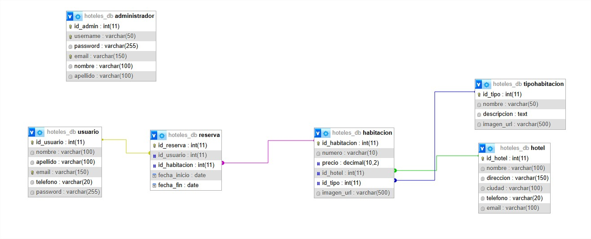

# TPE-Hoteles Etapa 1

# Integrantes
- Aaron Rafael Monteagudo (aaronmonteagudo800@gmail.com)  

# Descripción
El sistema permite que un usuario se registre con sus datos personales, elija un hotel y luego seleccione una habitación del tipo que prefiera (**Standard, Deluxe o Suite**).  
El modelo de datos contempla usuarios, hoteles, habitaciones, tipos de habitación y las reservas realizadas.

# Diagrama Entidad Relación (DER)


# Hoteles – Etapa 2

Sistema web dinámico para la **gestión de habitaciones de hotel**, desarrollado con **PHP, MySQL y el patrón MVC**.  
Incluye **acceso público** a listados y detalle de habitaciones, y un **panel administrativo** con login para ABM de habitaciones y tipos de habitación.

|------------------------|

## Instalación Local (Desarrollo)

###  Requisitos
- XAMPP (Apache + MySQL + PHP)
- PHP 7.4 o superior (recomendado PHP 8.0+)
- MySQL 5.7 o superior

### 🪜 Pasos
1. Copiar o clonar el proyecto en:  
   `C:\xampp\htdocs\hoteles`
   -Explicitamente tienes que crear una carpeta llamada "hoteles" y pegar el contenido en esa carpeta
      o
   -Modificar el htacces con la ruta de la carpeta creada en su defecto TPE-Hoteles-Main para mayor facilidad vendra por defecto asi
2. Iniciar **Apache** y **MySQL** desde XAMPP Control Panel.
3. **SI CAMBIAS EL NOMBRE DE LA CARPETA**, edita `.htaccess` línea 3:
   ```apache
   RewriteBase /TU-CARPETA/
   ```
4. Acceder desde el navegador a:  
   `http://localhost/TPE-Hoteles-Main/`

|------------------------|
## Despliegue en Servidor Apache + MySQL

### Requisitos mínimos
- Apache 2.4+
- PHP 7.4 o superior
- MySQL 5.7+ o MariaDB 10.4+
- Extensiones PHP: `pdo`, `pdo_mysql`, `fileinfo`, `gd`

### Pasos rápidos de despliegue
 **Crear base de datos:**
   ```sql
   CREATE DATABASE hoteles_db CHARACTER SET utf8mb4 COLLATE utf8mb4_general_ci;
   CREATE USER 'hoteles_user'@'localhost' IDENTIFIED BY 'tu_contraseña_segura';
   GRANT ALL PRIVILEGES ON hoteles_db.* TO 'hoteles_user'@'localhost';
   FLUSH PRIVILEGES;
   ```

 **Configurar conexión** en `config.php`:
   ```php
   define('DB_HOST', 'localhost');
   define('DB_USER', 'hoteles_user');
   define('DB_PASS', 'tu_contraseña_segura');
   define('DB_NAME', 'hoteles_db');
   ```

 **Importar base de datos** (automático o manual):
   - Si `hoteles_db` no existe, el sistema intenta crearla desde `hoteles_db.sql`.

   - También podés importarla manualmente desde phpMyAdmin → pestaña **Importar**.


 **Acceder desde el navegador:**

   http://localhost/TPE-Hoteles/
   
|------------------------|

##  Credenciales de Administrador

| Usuario    | Contraseña |      Rol      |
|------------|------------|---------------|
| `webadmin` |   `admin`  | Administrador |

---

## Estructura del Proyecto (MVC)

```
/hoteles
|── controllers/        # Controladores principales
|── models/             # Modelos (acceso a base de datos)
|── view/
|   |──uploads/         # Imágenes subidas
|   |── public/         # Secciones públicas
|   └── admin/          # Panel administrativo
|── config.php          # Configuración y conexión BD
|── hoteles_db.sql      # Script SQL de creación inicial
|── index.php           # Front Controller (punto de entrada)
└── .htaccess           # Router
```

|------------------------|

## Funcionalidades Implementadas

### Acceso Público
- Listado general de habitaciones.
- Detalle individual de habitación.
- Listado de tipos de habitación.
- Listado de habitaciones por tipo.

### Acceso Administrador
- Login y Logout.
- ABM completo de **Habitaciones** (ítems) y **Tipos de habitación** (categorías).
- Carga de imágenes desde archivo o URL.
- Validación de archivos y eliminación de imágenes huérfanas.


## URLs Principales

| Ruta | Descripción |
|------|--------------|
| `/hoteles/` | Página de inicio (listado público) |
| `/hoteles/habitaciones/1` | Detalle de habitación |
| `/hoteles/tipos` | Listado de tipos de habitación |
| `/hoteles/tipos/1` | Habitaciones por tipo |
| `/hoteles/admin/login` | Login admin |
| `/hoteles/admin/dashboard` | Panel administrativo |

|------------------------|

## Requerimientos Técnicos
- Vistas con plantillas `.phtml`.
- Patrón **MVC**.
- `.htaccess` reescribe las URLs mas amigables
- `index.php` lee esos parámetros (htaccess) y ejecuta el controlador
- Base de datos **auto-creada** si no existe (`config.php` ejecuta `hoteles_db.sql`).
- Manejo seguro de archivos e imágenes.

|------------------------|

## Notas sobre la Consigna

 Cumple con los **requerimientos funcionales**:
- Listados públicos, detalle, categorías, ítems por categoría.  
- Panel administrador con login/logout.  
- ABM para ítems (habitaciones) y categorías (tipos).  
- Carga de imágenes por archivo o URL.  

Cumple con los **requerimientos técnicos**:
- Patrón MVC.  
- Uso de plantillas `.phtml`.  
- Conexión dinámica a la base de datos.  
- Script SQL (`database.sql`) incluido para instalación.  

|------------------------|
## Futuras mejoras

- En próximas versiones del proyecto se planea ampliar las funcionalidades del sitio incorporando:

- Sistema de login para usuarios comunes, permitiendo que visitantes registrados puedan acceder a secciones personalizadas
  del sitio

- Gestión de reservas, donde los usuarios podrán realizar y administrar sus propias reservas desde su cuenta, con
  confirmaciones automáticas y control de disponibilidad en tiempo real.

- Panel de usuario, que mostrará el historial de reservas, opciones de cancelación, y actualización de datos personales.

|------------------------|
##  Contacto / Soporte
- Proyecto académico – Tecnicatura Universitaria en Programación de Aplicaciones Informáticas.  
- Autor: Aaron Rafael Monteagudo 
- Email: aaronmonteagudo800@gmail.com
|------------------------|
